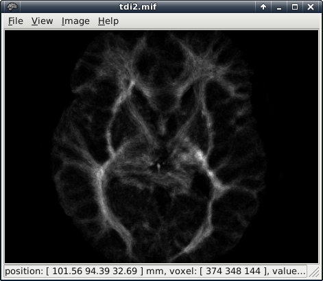

name: centred
layout: true
class: center, middle, inverse
---
# Diffusion Weighted Imaging Analysis
---
## Outline
### Background and Sequences
### Pre-processing steps
### Analysis Tools/Methods
### Final Thoughts
---
## Getting the data
---
layout: true
name: columns
class: inverse, middle
---
.left-column[
## Background
]
.right-column[
Diffusion Weighted Imaging is a method of acquiring images to get a measure of the amount of diffusivity across the brain. For each voxel, the intensity of the signal reflects an estimate of the water diffusion at that location.

Diffusion Tensor Imaging works by combining many such images taken with different gradient directions. We can then fit a tensor (diffusion ellipsoid) that sums up all the information from each gradient at each voxel building up information about the direction of diffusion.

Areas in the brain, such as white matter, where water diffuses more rapidly in the direction aligned with the internal structure and more slowly when perpendicular to the structure show up as having large directionality in the computed measures, and can be used to infer white-matter connectivity.
]
---
.left-column[
## Background
### - Sequences
]
.right-column[
Varying sequence components for diffusion can consist of:

* the number of directions

* whether a reverse phase encoded sequence is run

* the number of B0 measurements/repeat measurements

* whether the sequence was multi-shell
]
---
.left-column[
## Background
### - Sequences
### - Sequence Setup
]
.right-column[
A good heuristic is to acquire opposite phase encoded directions to help correct for eddy currents, distortions.

At least 40 directions should be acquired for b-values over 1000. Then time constraints/patient comfort and other factors will determine the number of directions, repeated measures and other factors.

A sample set of measurements might look something like:

* 1 P>A B0 as a separate sequence

* A second sequence with A>P, 2 sets of 64 b3000 measurements interspersed with B0 measurements..noted[*]

.footnote[
.noted[*]This would give multiple measures at each gradient direction to help correct for any movement, and an opposite direction to correct for susceptibility induced distortions.
]
]
---
.left-column[
## Background
### - Sequences
### - Sequence Setup
### - Sources of Noise
]
.right-column[
Certain things to look out for when acquiring data:

* Eddy current distortions

* Susceptibility Induced distortions (geometric distortion caused by B0 inhomogeneity)

* Movement can have a particularly large impact

* Other traditional MR artefact sources also affect quality.
]
---
template: centred
## First steps with the data
---
template: columns
.left-column[
## Pre-processing
### - Conversion
]
.right-column[
First step after receiving the DICOM files from the scanner is to convert them to a format that is recognised by the software you intend to use for the rest of your analysis steps. 

There are many conversion tools out there. A lot of analysis packages contain a conversion tool, or you can use a standalone tool.

The most widely used format, particularly for open source or freely available software is the nifti file format. The freely available `dcm2niix` package is one popular choice for conversion.

An important caveat here is to check with all software within your analysis pipeline for possible inconsistencies between not only what file format they support, but any differences in how they handle files (rotation of raw data and associated vector files for example)
]
---
.left-column[
## Pre-processing
### - Conversion
### - Correction
]
.right-column[
Most analysis toolchains for diffusion data will have some method for correcting for subject movement and eddy current distortions, and perhaps susceptibility distortions as well.

NOTE: In some instances it may be necessary to manually rotate the original bvecs (gradient vector information) after distortion/motion correction.

With FSL current versions recommend a combination of the `eddy` and `topup` tools.
]
---
.left-column[
## Pre-processing
### - Conversion
### - Correction
### - Diffusion Tensor Fitting
]
.right-column[
This is another steps that most of the analysis packages have an implementation of. It is this step that generates Fractional Anisotropy maps, Mean Diffusivity maps and more.

FSL has a processing step called `dtifit` that takes the eddy current corrected data, a whole brain mask, usually generated with it's brain extraction tool `bet` which strips the skull and external data from a B0 image, and then outputs a range of files, including those mentioned above.

`mrtrix` has the `dwi2tensor`, `tensor2FA` and `tensor2vector` tools.
]
---
template: centred
###A sample FA map, coloured based on the direction of diffusion
.center[]
---
.left-column[
## Pre-processing
### - Conversion
### - Correction
### - Diffusion Tensor Fitting
### - Co-registration
]
.right-column[
This involves registering either a B0 image from the diffusion sequence or the mean B0 if multiple B0 were acquired to a structural image (MPRAGE or similar).

Depending upon the later analysis steps this pre-processing step may or may not be necessary, however it is generally advisable as it allows individual diffusion results to be displayed overlaid on a higher resolution image, allowing the viewer to visualise position in the brain for significant features.

The method that FSL uses is to run a linear registration with 6 degrees of freedom.

An additional step can be to register each participants structural image to a standard brain (a popular choice is the [MNI brain](https://www.mcgill.ca/bic/resources/brain-atlases/human)). This then allows the results from each individual brain to be compared in a standard space.
]
---
template: centred
## Finalising the analysis
---
.left-column[
## Analysis
### - FSL (1)
]
.right-column[
.center[### BedpostX]

There are two primary streams of analysis that are prominent within the FSL suite of analysis tools for diffusion data. The first of these is probabilistic tractography (`ProbtrackX`) and a pre-requisite for that is `BedpostX`.

`BedpostX` uses Bayesian estimation to generate a folder with a large selection of files which are used in the probabilistic tractography. It is able to model crossing fibres using the Markov Chain Monte Carlo sampling to build up distributions at each voxel.

The script expects a data file containing a 4D series of brain volumes (with and without diffusion weighting) as well as a brain mask (separating skull and external regions from the brain). Finally it also requires a bvecs & bvals file that contain a list of gradient directions and b-values respectively applied during the acquisition (and in the same order as the data).
]
---
.left-column[
## Analysis
### - FSL (1)
]
.right-column[
.centre[### BedpostX continued...]

The output files are 3D and 4D volumes, primarily:

* samples and means of the distributions on theta, phi.noted[*] and fractional anisotropy

* means of distributions on diffusivity

* T2w baseline signal intensity

* Principle Diffusion Direction (PDD) distribution

* and finally uncertainty on the estimated fibre orientation.

Advanced options that can be fed into the script include changing the default number of fibres modelled per voxel, adding burn-in for the MCMC process and alternative models for multi-shell data and others.

.footnote[
.noted[*] theta and phi together represent the principle diffusion direction in spherical polar co-ordinates
]
]
---
.left-column[
## Analysis
### - FSL (1)
]
.right-column[
.center[### ProbtrackX]

This script runs probabilistic tractography with crossing fibres and takes as input the files created by the `bedpostx` script. The main premise of the script is to generate connectivity distributions from user-specified seed voxels, creating a single image in the space of the specified seed.

All brain voxels in the resulting image will have values representing the number of samples that pass through the voxel from the seed region.
]
---
.left-column[
## Analysis
### - FSL (1)
]
.right-column[
.centre[### ProbtrackX Seed Regions]

* If the seed region is in a non-diffusion space then transformation matrices (for linear registration) or warp-fields (for non-linear registration) need to be provided.

* Seeds can be specified as a single voxel, a single mask (one contiguous region) or multiple masks (tracts must pass through all supplied masks)

* .emphatic[Targets] can also be specified. The different types are waypoint masks (tracts that pass through either all masks or at least one mask are selected), exclusion masks (pathways that enter an exclusion mask are terminated) and classification masks (which classify seed voxels based on which mask tracts intersect.)

#### Options

There are too many options to discuss fully here, but options include changing the number of samples used, limiting the curvature of pathways, pathway loop checking and many more.
]
---
.left-column[
## Analysis
### - FSL (1)
]
.right-column[
.center[### Further steps]

If you have run a classification target `probtrackx` analysis (which creates a seed\_to\_{target} file for each target mask used) then the FSL diffusion toolkit provides a couple more scripts:

* `proj_thresh`: which converts seeds\_to\_{target} values from the total numbers of samples to the proportion of samples reaching any target mask that is over a specified threshold.

* `find_the_biggest`: performs hard segmentation of the seed region based on the outputs of classification targets.
]
---
.left-column[
## Analysis
### - FSL (1)
]
.right-column[
.center[### Other utilities]

FSL provides two more utilities that act on 3D/4D images files and are very powerful for extracting numbers out of the resulting files. These also can be very useful with the next analysis stream.

* `fslmaths`: Has a huge array of mathematical operations that can be performed on the data, including, but certainly not limited to, thresholding, adding/multiplying/subtracting images, spatial filtering and basic statistical operations.

* `fslstats`: Runs statistics on supplied images, including max/min/mean/standard deviation, outputting co-ordinates of max/min voxels, histograms, centres-of-gravity and more.
]
---
template: centred
### ProbtrackX tract representation in 3D
.center[
<video width="500" height="500" controls>
<source src="resources/animation.mp4" type="video/mp4">
<source src="resources/animation.ogg" type="video/ogg">
Your browser does not support the video tag.
</video>
]

.imlabel[The display threshold has been adjusted to clarify the representation]
---
.left-column[
## Analysis
### - FSL (1)
### - FSL (2)
]
.right-column[
.center[### Tract Based Spatial Statistics]

TBSS is an alternative to traditional voxel-wise statistical analysis of fractional anisotropy (FA) images. It aims to solve the issues of arbitrariness of spatial smoothing extent, and choice of standard registration algorithms. The steps in the analysis are:

The process takes FA images (from our `dtifit` step), erodes the data slightly to remove outliers and registers each image to a standard space (FMRIB58_FA, a user supplied target or the most representative from the set).

After registration each individuals FA has the transform applied, and they are combined to create a mean FA image. This is run through a skeletonisation step which creates an alignment-invariant tract representation. Finally TBSS thresholds the mean FA skeleton image and computes a projection from each individuals data onto the skeleton. This is then fed into voxel-wise statistics in the next section.
]
---
.left-column[
## Analysis
### - FSL (1)
### - FSL (2)
]
.right-column[
.center[### Voxel-wise Statistics and more]

TBSS results can be fed into the FSL `randomise` tool. This runs non-parametric permutation inference on the neuroimaging data, generally by applying a general linear model design matrix. Some examples are one-sample T-tests, two-sample Unpaired T-test with nuisance variables and repeated measures ANOVA. It generally outputs raw test statistics, uncorrected P statistics and family-wise error rate corrected P-values.

Other options for TBSS analysis are:

* Feeding non-FA images in TBSS (for instance mean diffusivity)

* Using crossing-fibre measures (for instance from the `bedpostx` tool)

* Warping TBSS results back to native space to use for tractography or validation.
]
---
template: centred
### TBSS results for significant (P<0.05) differences
.center[]
.imlabel[Group comparison showing regions of increased FA (red-yellow) from one group to another overlaid on the blue skeleton]
---
.left-column[
## Analysis
### - FSL (1)
### - FSL (2)
### - MRtrix
]
.right-column[
There are two currently two main streams of the `mrtrix` software. One available from Neurodebian (A Debian based package repository for Neuroimaging software). I am reasonably familiar with how this works and most of the discussion below will refer to this as `mrtrix`. There is also a new version `MRtrix3` that has been significantly reworked and is approaching an official release.

The mrtrix process was a number of smaller tools that did one job each. These tools could then be joined together by running them one after the other or _piping_ the output from one to the input of the next. A typical process for diffusion analysis using `mrtrix` follows on the next page.

`MRtrix3` offers many new workflows and supporting features for the analysis of diffusion data. Some supported capabilities include Anatomically-Constrained Tractography, Multi-tissue Constrained Spherical Deconvolution and Fixel-Based Analysis.
]
---
.left-column[
## Analysis
### - FSL (1)
### - FSL (2)
### - MRtrix
]
.right-column[
.center[### Steps in `mrtrix` analysis]
1. Create a brain mask

2. Create in order *tensor components*, a *fractional anisotropy (FA) map* and an *eigenvector (EV) map* to create the diffusion tensor model.

3. Estimate the response function (spherical harmonic) coefficients from single-fibre voxels and feed into the *constrained spherical deconvolution computation (CSD)* script

4. Similar masks to FSL can be used for fibre tracking, including *seed* masks, *include* masks, *exclude* masks and constraint masks (tracks terminated but not _discarded_ when they leave the ROI.)

5. Tractography can be done using the diffusion tensor model or the CSD model. With the CSD model both deterministic and probabilistic tracking can be done.

6. Whole brain tracking can be done by specifying the brain mask as both the seed and mask regions. Given enough generated tracts (1 million +) you can then use these images to create high-resolution track-density images.
]
---
template: centred
### Track-density image
.center[]
.imlabel[Shows the proportion of generated tracks entering each voxel]
---
.left-column[
## Analysis
### - FSL (1)
### - FSL (2)
### - MRtrix
### - Others
]
.right-column[
There are many other options for analysis of diffusion data, with many different strengths and weaknesses of each package. (The next screen shows a compiled list of such packages.)

Rather than commit to transferring data manually between packages, or staying within one package when it would not be optimal, several groups have developed workflow software that provides links to many of the individual data analysis tools, providing a consistent interface to the tools, as well as doing the heavy lifting in transferring data formats between systems.

One such project is `Nipype`, a python environment that provides easy interaction with tools from many different software packages. Workflows are written and saved in a python script which allows easy reproducibility. It also links with parallel computing software to share the load on many machines for large datasets and more.
]
---
template: centred
### DTI software options
.center[]
.imlabel[Taken from: “A hitchhiker's guide to diffusion tensor imaging” http://journal.frontiersin.org/Journal/10.3389/fnins.2013.00031/full]
---
template: centred
## General Observations/Final Discussion

### Masks

.uncentre[
There are multiple ways to generate masks used for tractography, including:

* Use masks from a predefined/default atlas. Fast. Lacks precision.

* Use masks from a structural analysis of the participants (Hand-drawn, automated or a combination of the two). Depending on the level of user involvement this can be a very time-consuming process, but does have good precision for the particular subjects.

* Use masks from another group that have scanned regions of interest in higher field strengths, e.g. 7T. This higher resolution allows greater delineation of the boundaries between regions of interest. (Assuming the local dataset was acquired on a lower resolution system, like 3T)
]
---
template: centred
## General Observations/Final Discussion

### Final Thoughts

.uncentre[
* Normalisation for comparing track data between subjects can be achieved by dividing the data by the total number of samples sent out or the waytotal.
* Thresholding the track data is for throwing away values with low probability of being on the tract and is a lot more subjective. The most important consideration here is to be consistent
]
